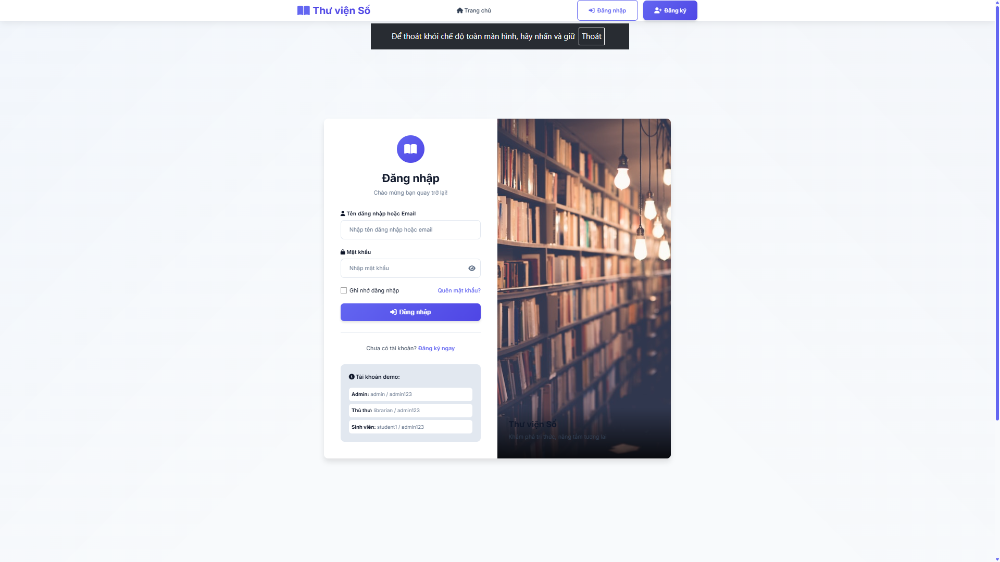
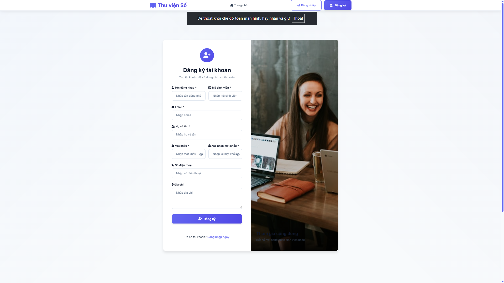
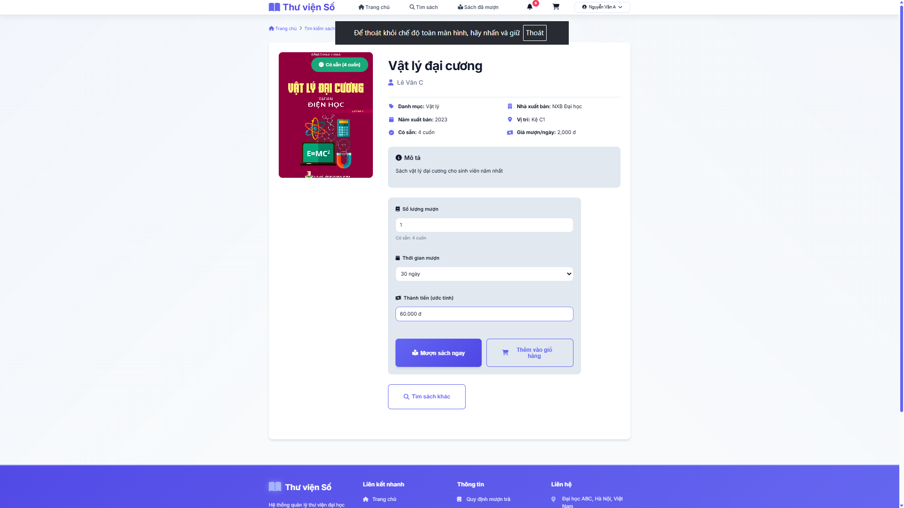
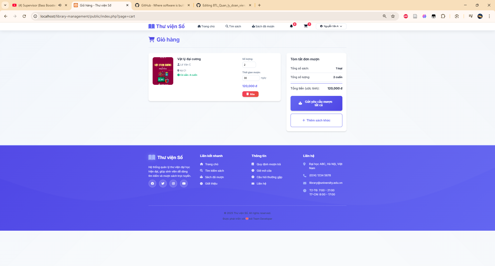
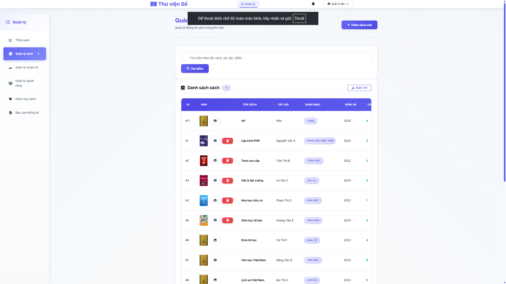
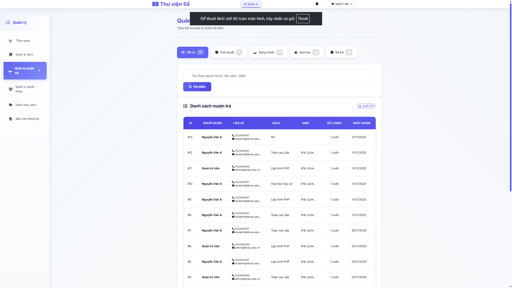
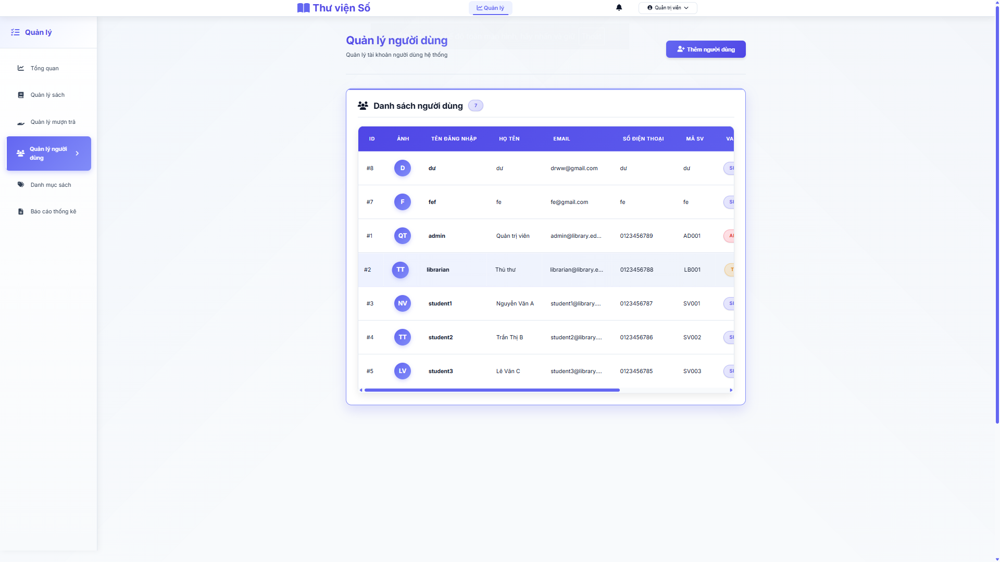
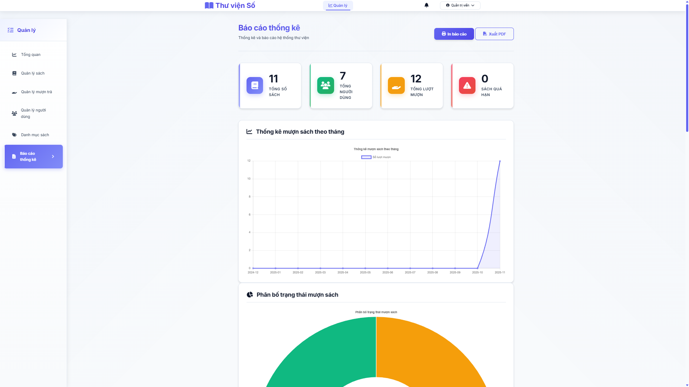

<h2 align="center">
	<a href="https://dainam.edu.vn/vi/khoa-cong-nghe-thong-tin">
	🎓 Faculty of Information Technology (DaiNam University)
	</a>
</h2>

<h2 align="center">
	Thư viện Số - Digital Library Management System
</h2>

<div align="center">
    <p align="center">
        
        
        
    </p>

[](https://www.facebook.com/DNUAIoTLab)
[](https://dainam.edu.vn/vi/khoa-cong-nghe-thong-tin)
[](https://dainam.edu.vn)

</div>
## 📖 1. Giới thiệu

Hệ thống Quản lý Thư viện hỗ trợ quản trị sách, người dùng, mượn/trả, thống kê và tìm kiếm trong môi trường đại học. Hệ thống thay thế việc quản lý thủ công bằng một ứng dụng web tập trung, dễ dùng, bảo mật và có khả năng mở rộng.

## 🔧 2. Các công nghệ được sử dụng

<div align="center">

### Hệ điều hành


[](https://www.microsoft.com/windows)
[](https://ubuntu.com)

### Công nghệ chính

[](https://www.php.net/)
[](#)
[](#)
[](#)
[](https://getbootstrap.com/)

### Web Server & Database

[](https://httpd.apache.org/)
[](https://www.mysql.com/)
[](https://www.apachefriends.org/)

### Database Management Tools

[](https://dev.mysql.com/downloads/workbench/)

</div>

## 🚀 3. Chức năng chính (Screens & Features)

- Đăng nhập

- Đăng ký người dùng

- Trang chủ, tìm kiếm sách theo từ khóa và danh mục

- Chi tiết sách

- Giỏ mượn

- Mượn/trả sách
- Quản lý sách

- Quản lý Mượn trả

- Quản lý Người dùng

- Dashboard thống kê và báo cáo

- Thông báo, lịch sử mượn trả của người dùng
  


## ⚙️ 4. Cài đặt

### 4.1. Cài đặt công cụ, môi trường

- Cài đặt XAMPP (khuyến nghị PHP 8.x)
  - Trang tải: https://www.apachefriends.org/download.html
- Cài Visual Studio Code và các extension đề xuất:
  - PHP Intelephense
  - MySQL
  - Prettier – Code Formatter

### 4.2. Tải project

Sao chép/giải nén project vào thư mục `htdocs` của XAMPP (ví dụ ổ D):

```bash
D:\xampp\htdocs\library-management
```

Hoặc dùng Git (nếu repo được public):

```bash
cd D:\xampp\htdocs
git clone <REPO_URL> library-management
```

Truy cập qua trình duyệt:

```
http://localhost/library-management/public/
```

### 4.3. Khởi tạo database

Mở XAMPP Control Panel → Start Apache và MySQL.

Tạo database MySQL (có thể dùng MySQL Workbench hoặc phpMyAdmin):

```sql
CREATE DATABASE IF NOT EXISTS library_management
  CHARACTER SET utf8mb4
  COLLATE utf8mb4_unicode_ci;
```

**Lưu ý**: Các bảng cần thiết (cart, notifications) sẽ được tự động tạo khi bạn truy cập ứng dụng lần đầu. Bạn chỉ cần tạo database `library_management` và ứng dụng sẽ tự động setup phần còn lại.

### 4.4. Cấu hình kết nối DB

Mở file `config/database.php` và cập nhật thông số cho môi trường của bạn:

```php
private $host = "localhost";
private $db_name = "library_management";
private $username = "root";      // thay bằng user của bạn nếu khác
private $password = "";          // thay bằng mật khẩu thật (ví dụ trên XAMPP thường để trống)
```

Lưu ý: File hiện tại có thể chứa giá trị tạm thời. Nhớ đổi `username`/`password` cho khớp máy bạn.

### 4.5. Chạy hệ thống

- Start Apache và MySQL (XAMPP Control Panel)
- Truy cập:

```
http://localhost/library-management/public/
```

Nếu server không trỏ `DocumentRoot` về `public/`, bạn có thể vào trực tiếp:

```
http://localhost/library-management/public/index.php
```

## 🧭 5. Điều hướng & Routes chính

User:
- `GET /?page=home` – Trang chủ
- `GET /?page=search` – Tìm kiếm sách
- `GET /?page=book-detail&id={id}` – Chi tiết sách
- `GET /?page=my-borrows` – Sách đã mượn
- `POST /?page=borrow-book` – Mượn sách (AJAX)

Admin:
- `GET /?page=admin-dashboard` – Dashboard
- `GET /?page=admin-books` – Quản lý sách
- `GET /?page=admin-users` – Quản lý người dùng
- `GET /?page=admin-borrows` – Quản lý mượn sách

Auth:
- `GET /?page=login` – Đăng nhập
- `GET /?page=register` – Đăng ký
- `GET /?action=logout` – Đăng xuất

## 🧩 6. Cấu trúc thư mục

```
library-management/
├── public/                 # Entry point & static (css/, js/, uploads/)
│   ├── index.php
│   ├── css/
│   ├── js/
│   └── uploads/
├── views/                  # Giao diện (auth/, user/, admin/, layout/)
├── functions/              # Business logic functions
├── handlers/               # Request handlers
├── config/                 # Kết nối DB, helpers & auto migration
│   └── database.php
├── assets/                 # Ảnh tĩnh
├── docs/                   # Tài liệu và logos
└── README.md               # Tài liệu này
```

## ✅ 7. Tài khoản demo (tuỳ chọn)

- Admin: `admin / admin123`
- Thủ thư: `librarian / admin123`
- Sinh viên: `student1 / admin123`

## 🛠️ 8. Lưu ý & Khắc phục sự cố

- Bật `mod_rewrite` và (khuyến nghị) trỏ `DocumentRoot` vào thư mục `public/`
- Nếu CSS/JS không tải: đảm bảo đường dẫn dùng dạng tương đối `css/...`, `js/...`
- Kiểm tra quyền ghi thư mục `public/uploads/`
- Kiểm tra lại `config/database.php` nếu không kết nối được DB
- PHP 7.4+ và MySQL 5.7+ (khuyến nghị PHP 8.x)

## 📚 9. Hỗ trợ

- Xem thêm: `USER_GUIDE.md`
- Báo lỗi/đề xuất: tạo issue trong repository
- Liên hệ: bộ phận hỗ trợ/kênh trao đổi của nhóm phát triển
